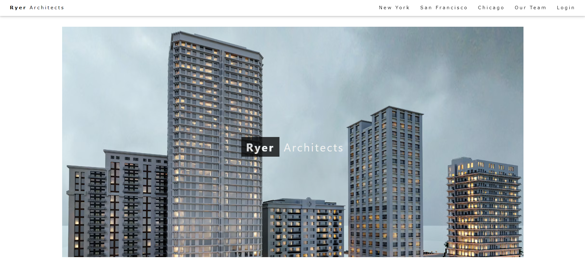
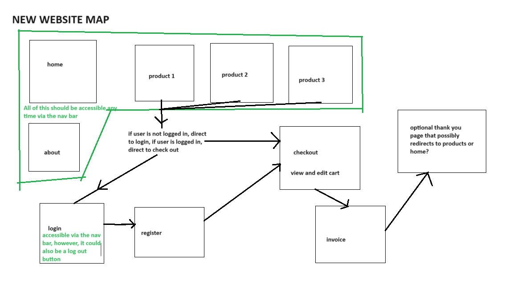

<div>  
  
</div>
Above is a screenshot of the home page.
<br>
<b>Ryer Architects</b> is the website I submitted for the final project of ITM352. For this project, I worked alone although I did recieve occasional help from the professor, Dr. Port. 

[Website Demo](https://youtu.be/lI1ncUDQii8?si=izOb77Pf_yqWlMEa)

By far, the most important part of this project was planning and organization. The first thing I did upon starting the project was to gather all the code I had from previous assignments and sort through it all to find what was and was not useful. After that, I labled everything in as much detail as possible, with the aim being that any random person would be able to discern what each block of code and variable is used for. 

<div>  
  
</div>
Above is a screenshot of the site map I made for the website.

The project had 4 main objectives that built off the work I had done during the whole course. They are as follows: 
1) add a shopping cart feature to the website so that users can shop at their leisure. 
2) enable arbitrary navigation of multiple product pages. 
3) email the user the completed invoice for each transaction.
4) maintain a user’s state (i.e. whether they are logged in).

The first objective was the most difficult and it required quite a bit of effort because it was my first time using sessions in JavaScript. At first it was difficult, but I kept working at it until I achieved my goal. The other onjectives were fairly easy because I had already designed my code in a way that made additional modifications easy. 

I ran into many technical and design issues when developing the game. The biggest technical issue I had, had to do with security. I don't know enough about website security to properly protect my website. Unfortunately there are fairly creative ways to work around the "guards" I put in the code. As of this writing, this coming semester I will be taking a whole class dedicated to web security, hopefully I'll come back to this and explain the security issues of the website in better details.

Here is some code that shows how the cart is updated:

```cpp
app.post('/update_cart', function(request, response, next){// updating the cart 
   console.log(request.query);
   // update the cart for this item
   request.session.cart[request.query.location][`quantity${request.query.productIndex}`] = Number(request.query.value);
   // the response will be json
   response.type('json');
   // turning the cart into a JSON string and sending it
   response.send(JSON.stringify(request.session.cart));
});
```

I received an A grade for the project, it was by far my favorite and but most difficult portion of the ITM352 class.

You can learn more about ITM352 here [ITM352 at the University of Hawai'i at Manoa Shidler Business College](https://shidler.hawaii.edu/courses/itm/352).

