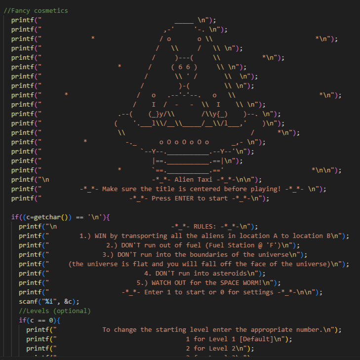
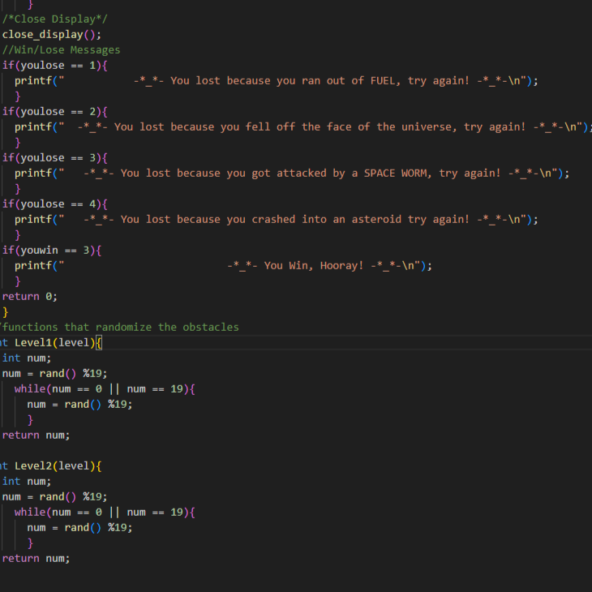

<div>  
  
  
</div>
<br>
<b>Alien Taxi</b> is a 2-D space themed game where a player transports Alien passengers from one point to another. The game is played on a 20 by 20 grid of cells that may contain obstacles, nothing, or Fuel stops. The game has 3 difficulty levels and ends when the player transports 3 passengers. The purpose of this project was to gain a deeper understanding of programming and develop programming skills. 

For this project, I served as <b>Project Facilitator</b> and <b>Lead Gameplay Developer</b>.

As<b> Project Facilitator </b>, I was responsible for delegating tasks, keeping the project on schedule, updating everyone on new developments, and making sure there were clear channels of communication. The project required my team to clearly label and document all our work, which I primarily oversaw. 

As <b>Lead Gameplay Developer</b> I oversaw the creative direction and technical scope of the project. Alien Taxi is directly inspired from a 2-D multiplayer keyboard game I played when I was younger.  That game, appropriately named “Alien Transporter” is unfortunately no longer available. I took the idea of transporting alien passengers with fuel and obstacle limitations, and brought it to my team who helped me realize it into our final project. 

<div>
  
</div>
<br>
We ran into many technical and design issues when developing the game. The biggest technical issue was that we wanted to create a randomly generated obstacle field that was different every game. This tied directly to our biggest design issue which was that we did not know how to make multiple levels of difficulty. The solution we found was to generate the obstacles on the grid before the game even started. The difficulty of the level would depend on the density of obstacles. 
Here is some code that shows how the obstacles were randomly generated every game:

```cpp
//functions that randomize the obstacles  
}
int Level2(level){
  int num;
  num = rand() %19;
    while(num == 0 || num == 19){
      num = rand() %19;
      }
  return num;
}
```

The <b>most important thing</b> I learned from this project is that good communication and teamwork goes further than one person with all the skills. Most of the problems we ran into weren’t easily solved and required us to talk it out, weighing our solutions against time and effort. 
 
 ```cpp
 /*     File : AlienTaxi.c        *
 *     By   : Lui                 *
 *     By   : Sam                 *
 *     By   : Kat                 *
 *     Class: EE160               *
 *     Team : Software Softies    *
 *     Date : 12/10/2021          */
```

We received top grades for the project, uniquely standing out for Alien Taxi’s fun design and engaging gameplay.

You can learn more about EE160 here [EE160 at Leeward Community College](https://catalog.leeward.hawaii.edu/ee-160).

